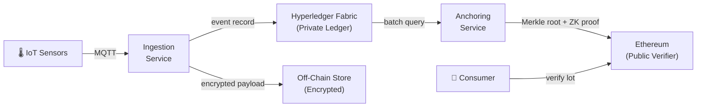
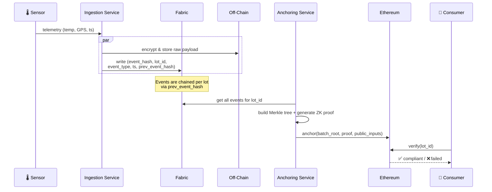
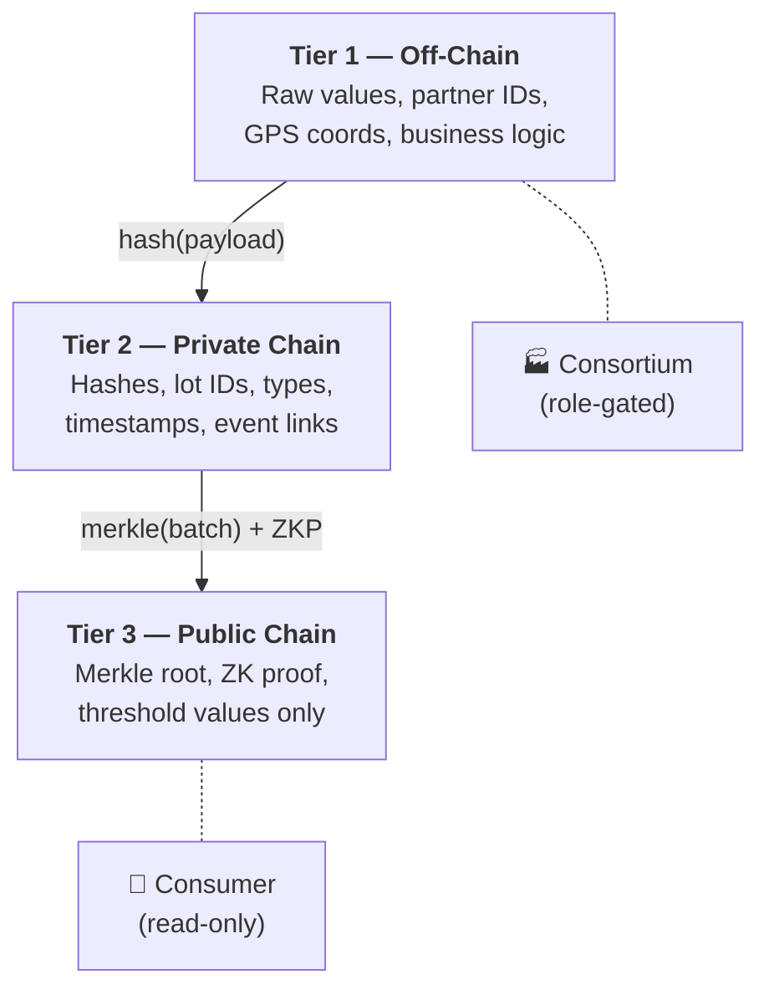
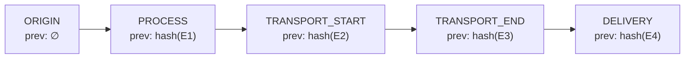

# Architecture

> Minimal working scheme — enough to reason about the system before writing code.

---

## Panoramic



**What goes where:**

| Layer     | Stores                                                               | Visible to                         |
| --------- | -------------------------------------------------------------------- | ---------------------------------- |
| Off-Chain | Raw sensor data (encrypted)                                          | Authorized consortium members only |
| Fabric    | `event_hash`, `lot_id`, `event_type`, `timestamp`, `prev_event_hash` | Consortium (role-based)            |
| Ethereum  | `batch_root`, `zk_proof`, `public_inputs` (thresholds)               | Everyone                           |

---

## 2. Data Flow

The lifecycle of a single IoT event, from sensor to consumer verification:



---

## 3. Privacy Model — Three Tiers

We deliberately split data across three isolation boundaries. The core idea: every layer downstream sees strictly _less_ than the one above it.



Why this matters: a consumer can verify that a cold-chain product stayed within temperature limits, but they'll never learn the exact readings, who the suppliers were, or which route the truck took.

---

## 4. Process-Awareness

Every event for a given `lot_id` carries a `prev_event_hash`, forming an append-only chain. This is what makes the system _process-aware_ — we don't just log events, we preserve their order and integrity.



When a lot reaches its final stage (DELIVERY), the Anchoring Service triggers: it collects all events, builds a Merkle tree, generates a ZK proof, and anchors everything to Ethereum.

---

## 5. Compliance Properties

We verify two properties in the ZK proof — both configurable, both domain-agnostic:

| Property               | What it checks                                     | Formula                       | Example         |
| ---------------------- | -------------------------------------------------- | ----------------------------- | --------------- |
| **P1** — Environmental | A measured value stays within a threshold          | `max(value) ≤ threshold`      | All temps ≤ 4°C |
| **P2** — Temporal      | A time-sensitive operation completes within an SLA | `max(transit_time) ≤ SLA_max` | Transport ≤ 8h  |

**P2** is computed from `TRANSPORT_START → TRANSPORT_END` pairs. Only complete pairs count.

The ZK circuit proves these properties over the batch **without revealing the actual values** — the public inputs are just the thresholds, and the proof attests that the private data satisfies them.

---

## 6. Repo Layout

```
progetto/
├── private-layer/          # Fabric network + Go chaincode
├── public-layer/           # Ethereum contracts (Solidity)
├── bridges/
│   ├── ingestion-service/  # IoT → Fabric (Node.js/TS)
│   └── anchoring-service/  # Fabric → ZK → Ethereum (Node.js/TS)
├── architecture.md         # ← this file
└── README.md
```
