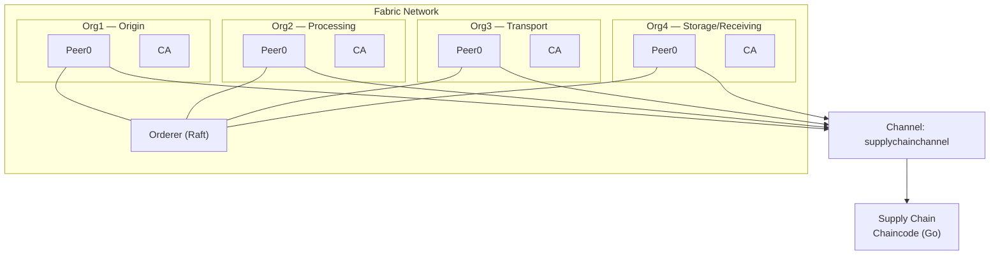

# Private Layer — Hyperledger Fabric Network

> The consortium backbone: a permissioned Fabric network where supply-chain events are recorded, chained, and kept private from the outside world

---

## What This Layer Does

This is the **Tier 2** of our three-tier privacy model. We store structured event records — hashes, lot IDs, event types, timestamps, and chain links — on a permissioned ledger. No raw sensor data ever touches this chain; that stays off-chain (Tier 1). The public chain (Tier 3) only sees Merkle roots and ZK proofs.

In practice, when the Ingestion Service pushes a supply-chain event, Fabric records a lean, hash-linked entry per `lot_id`. When a lot reaches its final stage, the Anchoring Service queries this ledger, builds a Merkle tree, generates a ZK proof, and anchors the result to Ethereum.

---

## Network Topology

We run a **4-organization** Fabric network, derived from the Hyperledger `fabric-samples/test-network`. Each org represents an abstract actor role in the supply chain:

| Org  | Role                             | Description                                                |
| ---- | -------------------------------- | ---------------------------------------------------------- |
| Org1 | **Origin Operator**              | Creates the lot — harvesting, donation, initial production |
| Org2 | **Process Operator**             | Transformation, validation, packaging                      |
| Org3 | **Transport Operator**           | Handles movement between facilities                        |
| Org4 | **Storage / Receiving Operator** | Final storage and delivery confirmation                    |

### Network Diagram

All four organizations join a single channel (`supplychainchannel`) and endorse the same chaincode.

---

## Starting from the Test Network

The network setup builds on top of [`fabric-samples/test-network`](https://github.com/hyperledger/fabric-samples). The test-network ships with 2 orgs; we extend it to 4 by adding Org3 and Org4 following the `addOrg3` pattern that's already included in `fabric-samples`.

### What We Changed

1. **Added Org3 and Org4** — crypto material, docker-compose files, and channel configuration for two additional organizations.
2. **Custom channel name** — `supplychainchannel` instead of `mychannel`.
3. **Chaincode** — our own Go chaincode for supply-chain event management (will be uploaded here once stable).

### Development Environment

The network is developed and tested under **WSL** (Windows Subsystem for Linux), since Fabric's tooling is Linux-native. The chaincode and network scripts live in a separate WSL workspace during active development; once stable, the chaincode source will be committed to this repo under `private-layer/smart-contracts/`.

**Prerequisites (WSL):**

- Docker & Docker Compose
- Go ≥ 1.21
- Hyperledger Fabric binaries & Docker images (via `curl -sSLO https://raw.githubusercontent.com/hyperledger/fabric/main/scripts/install-fabric.sh && chmod +x install-fabric.sh`)
- `fabric-samples` cloned and available
